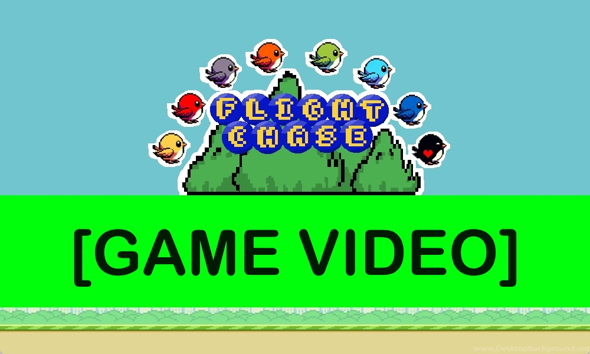
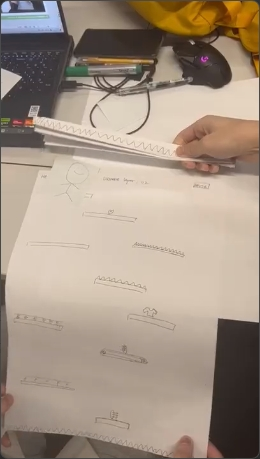

# 2024-group-11

↑↑↑Click to watch the game video↑↑↑

## Team
Overview of Software Engineering - University of Bristol MSc Group Project

Qiyuan Chen, ty23828@bristol.ac.uk, ty23828

Ahmed El Ashry, pu20789@bristol.ac.uk, ahmedcoolestman

Jialun He, cb23036@bristol.ac.uk, kkggbo

Ching-Chun Juan, iq23062@bristol.ac.uk, alicejuancc

Chen Lesheng，pp23991@bristol.ac.uk,chenlesheng2000(se2023passok)

### Group Photo

*Group photo of our MSc Software Engineering group at the University of Bristol*

## Introduction
With this project, we sought to create an engaging, visually pleasing and unique game. To achieve this, we wanted to introduce a twist to an easily recognisable and unique popular mobile platform and provide users with a computer version. We wanted to create a twist on a game we all played and loved growing up, so we decided to choose the frenzy-causing Flappy Bird from 2013. To make our game unique, we decided to add key differences, these include a multiplayer mode, a surprise attacking eagle enemy, coin collection, movable pipes, and customizable birds and backgrounds are just a few of the features that make our game unique and exciting. We worked together to achieve this game by following the agile software development methodology and instilling a strict test-driven and user-tested development ethos throughout our game development. We divided roles, planned tasks and collaborated on the implementation and documentation of features. This report will seek to outline the development process for our game, which we have called "Flight Chase" to illustrate the multiplayer "Chase" element at its core. 

**Main Page**

**Setting Page - Change Background**

**Setting Page - Select Modes**

**Normal Mode**

**Difficult Mode**

**2 Players Mode**

## Requirements

### Use Case Diagram

### Use Case Specification

### Developers and users stories
1. Game Developers and Designers
- As a developer, I want a robust game engine that supports 2D and 3D graphics, allowing for flexible and visually stunning gameplay.
- As a developer, I want an efficient debugging tool that provides real-time insights into the game's performance, helping me identify and fix issues quickly.
- As a developer, I want an easy-to-use scripting language that allows rapid prototyping and iteration of game mechanics, enhancing the development workflow.
- As a developer, I want a comprehensive multilayer framework that supports various modes (co-op, competitive) and provides tools for seamless online integration.
- As a developer, I want clear, concise, and regularly updated documentation, enabling me to understand and implement new features without unnecessary delays.

2. Players (End Users)
- As a player, I want the game to have the feature of saving the current progress so that I can restore the status after shutting down the game.
- As a player, I want the game to be challenging.
- As a player, I want the game to have a multiplayer mode to play with friends.

With user-driven development in mind, we sought to create several user stories to lay out what we believed the game should achieve and what would be expected. We developed a stakeholder model where we split up users into groups and delivered curated user stories to outline the game's needs. We focused primarily on ourselves as game developers and designers, and we came up with several requirements for the final product, including a robust game engine, an efficient debugging tool, an easy-to-use scripting language, a comprehensive multiplayer framework and clear documentation. 

Focussing on this further, we created a user story for ourselves as game designers, prioritising the workflow that would enable us to create an effective multiplayer game. Using the stakeholder-planning model for our development model and game, we showed our commitment to the agile software development approach. We needed an easy-to-use scripting language, and so the requirement of implementing the game in Processing was conducive to rapid development and yet still allowed us the necessary tools for game development. This went hand-in-hand with our requirement for seamless collaboration with the development team which was achieved through regular meetings, a rapid WhatsApp communication channel, a slower email channel, and GitHub documentation. Another interesting feature was the design of the bird and the eagle enemy, through our brainstorming and idea-forming process for the game, we used several AI art tools as inspiration for the game design but elected to create our characters as used in the game.

We developed other user stories to guide our development approach too. We stressed the importance of customizability, allowing users to change the bird's colour, representation and the game background. We wanted users to enjoy and track their progress so we created a high-score tracker that informed users of their achievements.  The continuous release of new birds, player characters, enemy characters, and backgrounds would incentivise players to continue playing our game and offer a unique twist on the original Flappy Bird through customizability. The potential of monetizing certain characters, backgrounds or "game modes" was another incentive for creating this game and its release to real-world platforms. We would have thoroughly focused a marketing campaign on the unique characters and backgrounds as we believe the customizability of this game is as important as the movable pipes, eagle and multiplayer "twists".

<!-- 
## Worked Through Use Case Specification
Player/Gamer

User Story: I want to customize my bird's appearance in the chameleon chase.

Customizing the Bird's Appearance

Actor: Player

Precondition: The player launched Chameleon Chase

Main Flow:

  1. The player selects the customization menu
  2. Accesses Bird Appearance Options
  3. Choose a Colour Scheme
  4. Applys Patterns and Accessories
  5. Previews Customized Bird
  6. Saves the Customization

Postcondition: The player's bird is updated according to their customization

Alternative: If the customized version is not saved, the default is selected

Exceptions: Technical issues/limitations stop customization from being saved

Success Scenario: Personalised gameplay with customized bird

Future: Customization options expand with new updates, and achievements (Such as bronze, silver, and gold for high scores) can be attached to the user's bird 
-->

### Early-stage Design and ideation process

In the early stages, we had various ideas for the game such as Flappy Bird, BrickBreaker and NS-Shaft. After a group discussion, we decided to implement paper protopyes on the two ideas with the highest support.

#### Paper Prototypes
##### 1. NS-Shaft

##### 2.Colourful Flappy Bird

After the paper prototypes ended, we unanimously decided to use the idea of Colorful Flappy Bird and formulate the rules: In this version of Flappy Bird, the pipes and the bird are dynamically changing colours. The twist is that the player must control the bird to match its colour with the upcoming pipes to pass through them. The second twist is that the pipes move dynamically to trap the bird. The third twist is that there are two players and the two players each control a racing bird (whose speed can be adjusted by the arrow keys).

Finally, we wanted the game to be educationally friendly and help young children get used to using a computer and keyboard so we sought to design an easy-to-play game, recognisable and fun to play for anyone. Thus we limited the keys to the spacebar and up button to ensure the game is simple and easy to understand. These requirements helped drive our eventual design and motivated us to choose Flappy Bird as the game to develop a twist on.

## Design
### Class diagram

Regarding the system architecture, before the development process, we initially defined the core elements of the game: birds, pipes, coins, and user interface buttons. During this stage, we formulated the initial version of the class diagram.

*Initial version of the class diagram*

As the game development progressed, we needed more classes and functions to increase the richness of the game, make the code tidier and enhance readability. Throughout this process, we iterated through seven versions, and by the final version, the class diagram has developed into the following architecture. Besides the core elements, we also added a class of the eagle as the twist to the game, to increase the difficulty, giving players surprises. Also, we transformed the main game screens: Main Menu, Settings Menu, Level (Playing screen), and GameOverMenu into classes to facilitate independent development.

*Final version of the class diagram*

### Behavioural diagram

"Flight Chase" is a game with a straightforward objective: players must navigate through obstacles, such as pipes and eagles while collecting as many coins as possible. Therefore, we made a communication diagram so we could have a clearer understanding of the interaction between objects during the development process.

*Communication diagram depicting the interaction between game objects*

### Design Conclusion

In conclusion, before game development, we applied the software engineering methods learned in the taught component of this module to outline a rough system architecture. This allowed us to develop prototypes, facilitate rapid consensus among all team members on the content and reduce communication time.
Through adopting the Agile methodology, we iterated through seven versions throughout the development process. Despite this, we set up the initial system architecture at the first stage but new ideas constantly emerged during development. The final class diagram is much more complex than the initial version, and there are also many differences between the original design documents and the final game results. Design documents cannot provide all the details in the development stage as a reference. We had to improve and add the content in design documents while considering the variables and methods needed for the new classes during development.
However, it is undeniable that a clear system architecture is essential for the development process. It is the game's backbone and provides the foundation for other design elements.

## Evaluation

### Qualitative Evaluation
The Qualitative Evaluation used two methods, Think-aloud and Heuristic Evaluations. They helped us understand the users’ thoughts well and helped with improvements in the next stage.

#### Think Aloud
We have set up two tasks for Think Aloud: 
1. Change bird color.
2. Get 20 points.

In the process of completing the task, we take into account the user's behaviour and language. We invited 5 users to conduct this test and compiled the results of 3 more representative users.

| Think Aloud      | Advantages                                                  | Disadvantages                                                                                                                                                                 |
|------------------|-------------------------------------------------------------|-------------------------------------------------------------------------------------------------------------------------------------------------------------------------------|
| Think Aloud 1    | - Simple and easy-to-understand game rules                 | - Difficulty finding keyboard keys required for the game - Lack of clarity on changing some settings                                                                       |
| Think Aloud 2    | - Familiarity with similar games aids understanding        | - Lack of understanding regarding the function of non-traditional game elements, such as yellow dots that increase points                                                     |
| Think Aloud 3    | - Gravity simulation enhances realism                      | - Lack of consequence for hitting bottom or top reduces game difficulty and playability                                                                                       |
#### Heuristic Evaluation
| Interface                 | Issue                                                        | Heuristic(s)            | Frequency 0 (rare) to 4 (common) | Impact 0 (easy) to 4 (difficult) | Persistence 0 (once) to 4 (repeated) | Severity = Sum Total of (F+I+P)/3 |
|---------------------------|--------------------------------------------------------------|-------------------------|----------------------------------|-----------------------------------|-------------------------------------|------------------------------------|
| Game tutorial interface   | There are no detailed operating instructions and I don’t know how to operate and don't know the rules of the game. | Help and documentation | 4                                | 4                                 | 2                                   | 3.33                               |
| Game settings menu        | Can't pause during game play                                  | User control and freedom| 3                                | 3                                 | 3                                   | 3.00                               |
| Game settings menu        | Navigation menus hide several important features, and users must remember where to find them. | Recognize rather than recall | 2                              | 2                                 | 4                                   | 2.67                               |
| Game tutorial interface   | Two-player mode has special rules different from the single-player mode. | Help and documentation | 1                                | 4                                 | 1                                   | 2.00                               |
| Game display interface    | The pattern of gold coins is not obvious and can easily be misunderstood. | Consistency and standards | 4                              | 1                                 | 4                                   | 3.00                               |
| Difficulty selection interface | No option to increase difficulty                          | User control and freedom | 2                                | 2                                 | 3                                   | 2.33                               |

According to Heuristic Evaluations, we found three issues with Severity at 3 or above indicating issues that need us to solve them in time. The key problem was that there were no detailed operating instructions, players didn't know how to operate and the rules were unclear. Its Severity is 3.33, which is the highest among all projects. It shows that it will greatly affect the user experience.

Combining Think Aloud and Heuristic Evaluations, we found that there are three major problems:
1. There are no detailed operating instructions and users do not know how to operate.
2. The game cannot be paused during the game.
3. Some game elements are not very recognizable.

These issues have been mentioned many times in Think Aloud and have relatively high Severity in Heuristic Evaluations. This means we will focus on and solve them in the next step. We held group discussions and identified solutions to address these issues in the next step.

Solution:
1. Added text guidance to the game to explain the rules.
2. Add a button to pause the game in the game.
3. Optimize the game graphics and replace the original elements with simple easy-to-read patterns, such as changing yellow dots to coin patterns.

We believed that after solving these problems, the quality of our game would be significantly improved.

### Quantitative evaluation

#### NASA TLX
We use NASA TLX to evaluate the difficulty of the game. We invited ten participants to rate the easy mode and the difficult mode. The following are the scoring results:

Easy Mode: NASA TLX
| Participant Number | Mental demand | Physical demand | Temporal demand | Performance | Effort | Frustration |
|--------------------|---------------|-----------------|-----------------|-------------|--------|-------------|
| 1                  | 2             | 2               | 1               | 1           | 1      | 4           |
| 2                  | 11            | 8               | 13              | 12          | 16     | 3           |
| 3                  | 18            | 3               | 20              | 6           | 10     | 15          |
| 4                  | 4             | 5               | 8               | 6           | 4      | 8           |
| 5                  | 10            | 12              | 10              | 10          | 9      | 9           |
| 6                  | 3             | 3               | 3               | 3           | 3      | 1           |
| 7                  | 8             | 10              | 11              | 9           | 8      | 9           |
| 8                  | 5             | 5               | 6               | 6           | 6      | 4           |
| 9                  | 12            | 13              | 12              | 12          | 11     | 10          |
| 10                 | 2             | 1               | 1               | 2           | 3      | 2           |

Hard Mode: NASA TLX
| Participant Number | Mental demand | Physical demand | Temporal demand | Performance | Effort | Frustration |
|--------------------|---------------|-----------------|-----------------|-------------|--------|-------------|
| 1                  | 10            | 6               | 10              | 6           | 16     | 16          |
| 2                  | 14            | 16              | 18              | 14          | 17     | 15          |
| 3                  | 20            | 12              | 20              | 13          | 15     | 18          |
| 4                  | 10            | 16              | 15              | 16          | 20     | 17          |
| 5                  | 18            | 18              | 16              | 15          | 17     | 20          |
| 6                  | 15            | 16              | 15              | 14          | 18     | 14          |
| 7                  | 12            | 13              | 15              | 12          | 14     | 13          |
| 8                  | 10            | 15              | 18              | 15          | 12     | 8           |
| 9                  | 15            | 16              | 14              | 15          | 14     | 13          |
| 10                 | 5             | 5               | 10              | 10          | 11     | 10          |

Final Result
| Participant Number | Easy Mode Workload | Hard Mode Workload | Difference |
|--------------------|--------------------|--------------------|------------|
| 1                  | 11                 | 64                 | -53        |
| 2                  | 63                 | 94                 | -31        |
| 3                  | 72                 | 98                 | -26        |
| 4                  | 35                 | 94                 | -59        |
| 5                  | 60                 | 104                | -44        |
| 6                  | 16                 | 92                 | -76        |
| 7                  | 55                 | 79                 | -24        |
| 8                  | 32                 | 78                 | -46        |
| 9                  | 70                 | 87                 | -17        |
| 10                 | 11                 | 51                 | -40        |

We used the Wilcoxon signed-rank test to perform a significance test for the NASA TLX. We analyzed the test results and believed only a p-value of 0.05 was significant. The following is the detection process:

Wilcoxon Signed-Rank Test Calculator process
| Difference | Rank | Signed Rank |
|------------|------|-------------|
| -17        | 1    | -1          |
| -24        | 2    | -2          |
| -26        | 3    | -3          |
| -31        | 4    | -4          |
| -40        | 5    | -5          |
| -44        | 6    | -6          |
| -46        | 7    | -7          |
| -53        | 8    | -8          |
| -59        | 9    | -9          |
| -76        | 10   | -10         |

We can conclude from the above that the positive sum of ranks is 0 and the sum of negative ranks is 55, so the W value is 0 (the W value is just the smaller of the positive and negative sums). This is well below the W value of 8 required for statistical significance. A W value of 0 is statistically significant with a p-value of 0.05. These results confirm that the increase in the difficulty of our game's "Hard" mode relative to the "Easy" mode is statistically significant. In addition, the result of W test statistic = 0 is consistent with a p-value of 0.005, illustrating that our hard mode is more difficult than expected.

### Testing

#### White Box Testing
We first find the code segment for collision implementation and set two tasks:
1. Boundary condition test: Check whether the object can correctly detect a collision when it touches the boundary.
2. Overlap test: Test whether the system can accurately calculate and respond to collisions when two objects overlap.

After the test, we found that the actual results were the same as the expected results and no functional defects or abnormalities were detected.

#### Black Box Testing
We open the archive as a new player and set two tasks: 
1. Score accumulation: whether you can add points by interacting with gold coins or passing through pipes.
2. Highest score record: Whether the highest score scored by a player will be recorded.

After the test, we found that the actual results were the same as the expected results and no functional defects or abnormalities were detected.

## Implementation

Our game is a side-scrolling jumping game, where players control a bird to dodge pipes and eagles flying in from the right side of the screen while collecting coins to score points. In the early stages of development (before version 0.7), our team used graphics drawing methods in Processing to represent various objects. However, starting from version 0.7, we incorporated art and sound assets and refactored the code.

The main classes in our game include `Button`, `Bird`, `Pipe`, `Coin`, multiple Interface classes (`Main Menu`, `Settings Menu`, `Level`, and `Game Over Menu`), and `Eagle`. Most of these classes have relatively simple functionalities. The `Button` class primarily handles modifying other objects, such as changing the bird's colour or the current menu after mouse clicks. Interface classes manage and present the user interface (UI). The `Coin` and `Pipe` classes generate randomly at certain positions in the game and move leftward periodically. The `Eagle` class rapidly moves from one position toward the bird's location and detects collisions.

Implementing the `Bird` class posed the greatest challenge, as the bird object needed to perform various functions, including responding to player commands (jumping), interacting correctly with other objects (pipes, coins, eagles), allowing players to change its colour and quantity, implementing complex animation effects, and incorporating a health system. The three main challenges encountered were Collision Detection, Bird Transit Through Screen Borders, and Two-Player Mode.

### Challenge 1: Collision Detection. `Collision Class`
There are 4 types of entities: the player-controlled bird, pipes, coins, and eagles. Handling the collisions between these is an important part of our game. We wrote two methods: circle-to-circle collision detection (bird with coins and eagles) and circle-to-rectangle collision detection (bird with pipes). Circle-to-circle collision detection is simple, only requiring checking whether the distance between the centres of the two circles is less than the sum of their radii. Circle-to-rectangle detection is more complex, first requiring the identification of the closest point on the rectangle to the circle and then determining if the distance from this point to the circle's centre is greater than the radius. This challenge is more mathematical, but the coding implementation was straightforward after understanding the principles.

### Challenge 2: Bird Transit Through Screen Borders.
In the early versions of the game, the bird could not fly out of the screen. So players could keep the bird on the floor for a long time without any action as an easy way to dodge pipes. Therefore, we decided to modify the game mechanics to allow the bird to transition between the top and bottom borders of the screen. Implementing this feature took quite some time. To make the animation look smooth, we ensured that the part of the bird disappearing from one side of the screen and the part appearing on the other were always complementary. After the bird's body completely left the screen, its position would be adjusted to the opposite side of the screen. This required changes not only to the existing method of displaying the bird but also to the collision detection methods (the bird should have collision detection for both parts during transit), and the death animation of the bird (after the bird dies, it should not appear from the top when it falls off the bottom of the screen). After a long time and numerous tests and adjustments, the effect finally met our satisfaction.

### Challenge 3: Two-Player Mode.
The two-player mode is a highlight of our team's game, allowing two players to choose birds of different colours to play together and avoid pipes that match their bird's colour. The two-player mode implementation is not as simple as adding another bird object based on single-player mode; it accompanies many new features and adjustments to existing code. This includes adjustments to the pipe generation frequency as it's necessary to lower the game difficulty if players have the same colour and avoid all pipes. Adjustments to the eagle's behaviour are required - in the two-player mode if both players are alive, the eagle will always attempt to lock onto a different player each time. The game's end conditions also need modification; when one player dies, the other should be able to continue playing, among other things. Implementing the two-player mode took us quite some time, and occasionally, new bugs would arise during the implementation process.

## Process

Our team collaborated effectively throughout the development process. We utilised various tools and methodologies to streamline our workflow and ensure productive teamwork.

### Communication

We primarily used WhatsApp messaging for communication, having a running group chat to share updates, ask questions and issue reminders in real time. This allowed us to maintain an agile approach, and quickly change tac if things weren’t working. Creating polls for meetings, decision-making and design choices allowed a democratic and team-centred approach when creating the game. Additionally, we often communicated using our Git messages, through commits and pull requests, allowing team members to stay up-to-date with each other’s changes.

### Project Management

In addition to effective messaging to ensure tasks were carried out and deadlines were met, we utilised a shared KanBan board to ensure all tasks were carried out. This enabled team members to implement features directly, even if they had missed meetings where discussions on the next steps took place. Alongside this, we used the existing communication channel in WhatsApp to assign responsibilities, track progress and prioritise tasks effectively. Team members were then given individual freedom to use certain task management tools independently to ensure tasks were carried out, with some opting for Notion and others for Trello. This allowed autonomy within the development process. 

### Version Control

For code collaboration and version control, we relied on Git’s Version Control. We wrote code using the VSCode IDE before uploading it to Git. When needing to collaborate, users could pull/push code as required with separate branches for each member’s testing and features and another develop branch for incremental changes, before they would be continuously merged into the main branch. This ensured everyone had access to the latest codebase and could contribute seamlessly. We frequently implemented pair programming or discussion of features in-labs, with subsequent implementation to ensure collaboration and minimise errors. 

### Documentation

Maintaining comprehensive documentation was crucial for clarity and knowledge sharing. We relied heavily on our in-person meetings to verbally discuss the project, next steps and features to implement. There, team members would take turns to illustrate their work and ensure each member was comfortable understanding the code and the result. This was backed up by information available on GitHub and on the WhatsApp communication channel. Alongside this, we used the Update Log to discuss the latest changes for each version. We discussed using a dedicated documentation tool but agreed that the project's scope meant it wasn’t needed initially. As the project expands, this is an area to look into, with more robust documentation required. 

### Team Roles and Responsibilities

We assigned roles from the beginning of the project, which ensured clarity in responsibilities and accountability, facilitating a smooth development process. Project management was completed rotationally, with Jialun taking the lead for the code, Quiyuan for sound and library integration, Alice for design, and Ahmed for the report. Splitting up the project into smaller manageable tasks increased focus and efficiency. This also allowed team members with more expertise in one area to guide others onto the correct path. Correspondingly, members were able to contribute more in different fields. 

- Jialun led the coding and code development process and the team responsible for code implementation and execution, while also helping out in design and animations.
- Qiyuan worked closely with Jialun on development and execution and implemented sound for the project alongside researching, implementing, and utilizing resources and libraries.
- Alice was responsible for the design interface, coding the main menu, buttons, and pipes, alongside general gameplay design, and class design.
- Ahmed was responsible for project planning and design as well as testing (both internal and external), creating focus groups, and carrying out evaluations as well as unit testing and code tests.
- Chen was responsible for the development and helped implement difficulty levels, accelerate bird/pipe movements, and control gameplay physics.

### Team Evaluation

Our collaborative efforts were characterised by open communication, mutual respect, and a shared commitment to project success. Regular team meetings allowed us to discuss progress, address challenges, and brainstorm solutions collaboratively. Each team member brought unique skills and perspectives to the project, contributing to a well-rounded and innovative final product.
We recognised the importance of adaptability and flexibility in response to evolving project requirements and feedback. Team members were proactive in seeking clarification, providing constructive feedback, and offering support to one another when needed. Our teamwork was instrumental in overcoming challenges, achieving milestones, and delivering a high-quality project.

## Conclusion

### Reflection

This project was an engaging opportunity from start to finish, allowing us to develop software engineering skills in a realistic setting to deliver a useful product. Initially, we were nervous about the execution of the project on time but increased in confidence when achieving our targeted milestones. The most important point for us was delivering an MVP before Week 4. This gave us confidence in ourselves, the agile approach and the tools and processes we used. Working together and learning more about each other along the way was equally rewarding as picking up new skills through the term, and having a team of 5 students from international backgrounds allowed us to share new perspectives and experiences. 

Over time, the scope of the project changed and developed. We started conservatively, in keeping with the agile approach, but were constantly able to outdo and outperform our expectations. In the end, we executed almost every feature concerning the project. 

### Lessons Learned

Throughout the project, we learned key technical and professional skills. Technically, we learned a new Development language in Processing, understood the basics of game development, and implemented the Agile Software Engineering approach. Professionally, we learnt key skills in  time organisation and decision-making. Individually, each member benefited from the technical competencies acquired to carry out their tasks whereas as a team, we benefited from each other’s knowledge, curiosity and experiences. Successfully, we were able to design a game that met with the project brief and was enjoyable and challenging to play. However, we faced setbacks along the way, especially in streamlining work, preventing overlapping tasks and ensuring strict timing and scheduling. Despite this, we all enjoyed and learnt from working with each other. 

### Challenges Faced

The project was not without technical challenges, as our vision for a multi-player game posed some tough issues. Technically, that was an important challenge to maintain separate sprites, scores, pipes, eagles, and movements for each player. This was achieved through careful software engineering, effective testing, and a structured object-oriented development approach. Likewise, ensuring game difficulty was appropriate was a key factor, with several challenges such as pipe movement, collision physics, and the movement of an enemy eagle. Ensuring these challenges were met was a well-planned object-oriented code approach which allowed for agility and versatility throughout the development process. Ensuring all this worked well, was a key challenge professionally, requiring dedication and commitment from team members as well as decision-making, task prioritisation and effective communication, which was streamlined enough for success, but could do with improvement. 

### Future Work

To improve the game further and continue development, we have compelling ideas. We have discussed additional elements such as newer levels, 3-dimensional gameplay, multi-player modes via internet connectivity, and customisable “suits” or emojis to replace birds - with a user-led character store to purchase new “suits”/characters - purchasable with game tokens. These ideas would all require user and stakeholder feedback, prompt planning, evaluation and testing and a robust plan to carry out a new round of agile development. However, with the skills learnt from this project, and a greater influence on robust documentation and daily communication, we believe we are up to this new and exciting task. We hope you enjoy playing our game and look forward to developing it further following feedback, aiming for the perfect user experience. 

## Individual contribution:

Qiyuan Chen: 1

Ahmed El Ashry: 1

Jialun He: 1.5

Ching-Chun Juan: 1

Chen Lesheng: 0.5
