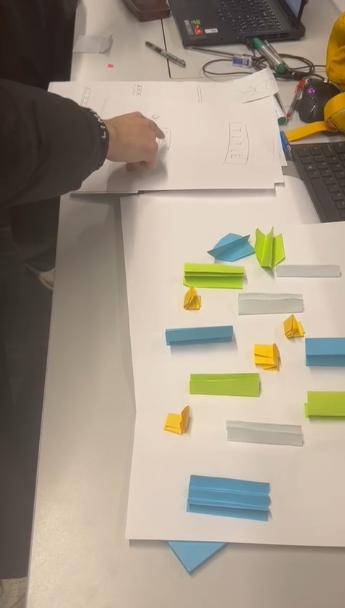

# 2024-group-11
Overview of Software Engineering - University of Bristol MSc Group Project

Qiyuan Chen, ty23828@bristol.ac.uk, ty23828

Ahmed El Ashry, pu20789@bristol.ac.uk, ahmedcoolestman

Jialun He, cb23036@bristol.ac.uk, kkggbo

Ching-Chun Juan, iq23062@bristol.ac.uk, alicejuancc

Chen Lesheng，pp23991@bristol.ac.uk,chenlesheng2000(se2023passok)

# Group Photo

# Game ideas:
## Game Idea 1: Flappy Bird Name: Chameleon Chase 
In this version of Flappy Bird, the pipes and the bird are dynamically changing colors. 
The twist is that the player must control the bird to match its color with the upcoming pipes to pass through them.
The second twist is that the pipes move dynamically to trap the bird.
The third twist is that there are two players and the two players each control a racing bird (whose speed can be adjusted by the arrow keys)

## Game Idea 2: BrickBreaker

In "Pixel Bouncer," the classic brick breaker game takes a twist with a pixelated, retro aesthetic. 
Players control a bouncing pixel ball with the goal of breaking colorful pixel bricks in a dynamic and evolving environment. 
The twist comes with the introduction of various power-ups, challenging obstacles, and a unique bouncing mechanic.
The speed and direction of the balls can be adjusted by the area of the paddle stricken with. Hitting  CERTAIN moving animal ends the game. 
There are multiple mitating levels of increasing difficulty and hitting a certain ball can reverse direction, change ball size, and reverse
gravity. 

## Game Idea 3: NS-Shaft

In the game, a player can control the left and right direction keys to move to the left or right. 
As the platform continues to rise, the goal is to allow the player to go down the maximum number of floors.
The player has a total of 12 points of health. If contacting the spikes on the ceiling or the spike platform, 
he will receive negative points of damage. 
When the player is injured by the spikes on the ceiling, he will be forced to leave the platform and jump down. 
The game ends when the health point reaches zero or when the player falls to the bottom.

  Twist:
  Items appear randomly to allow the player to restore health points or change the platform on the field.

  Challenges: 
  1. Implementing dynamic behaviors for various platforms (ordinary, fake, spring, crawler, spiked) and ensuring precise collision detection.
  2. Managing the health system and accurately calculating damage from spiked platforms.
  3. Balancing difficulty across platform types, adjusting spiked platform frequency, and the speed of the rising platform.

# Paper Protopyes
## 1.NS-Shaft

## 2.Colorful Flappy Bird

# Requirements
## Stakeholders and user stories
1. Game Developers and Designers
- I want a robust game engine that supports both 2D and 3D graphics, allowing for flexible and visually stunnning gameplay
- I want an efficient debugging tool that provides real-time insights into the game's performance, helping me identify and fix issues quickly
- I want an easy-to-use scripting language that allows rapid prototyping and iteration of game mechanics, enhancing the development workflow
- I want a comprehensive multilayer framework that supports various modes (co-op, competitive) and provides tools for seamless online intergration
- I want docimentation that is clear, concise, and regularly updated, enabling me to understand and implement new features without unnecessary delays

Game Designers User Story
- I want an intuitative level editor that allows me to create diverse and engaging game environments with ease, allowing me to relaise my creative visions
- I want access to a vast libray of assets - incl. characters, objects and environments, to enhance the visual appeal of the game without compromising the
performance
- I want a flexible AI system that allows me to create challenging and dynamic enemy behaviours, contributing to an immersive and enjoyable player experience
- I want analytics tools that provide valuable player data, allowing me to make informed decisions about game balance, difficulty and feature improvement
- I want collaboration features that enable seamless communication with the development team, ensuring a smooth integration of design elements into the final
project
2. Game Publisher User Story
- I want a detailed, customizable analytics dashboard that provides info on player engagement, retention, and monetization, supporting data-driven decision
making
- I want a reliable and secure solution to protect IP while minimizing impact on player experience
- I want marketing tools integrated into the game platform, allowing for targeted promotions, advertisments, and community engagement to boost game visibility
and sales
- I want seamless integration with popular gaming platforms and storefronts, simplifying the distibution process and maximising game's reach
- I want a transparent and collaborative relationship with the development team, including regular progress updates and open communication channels 

3. Players (End Users)
- As a player of the game, I want the game to have the feature of saving the current progress so that I could restore the status after shutting down the game.

4. Investors and Financiers
- As a investor and financier, I want to experience constant updates and new content to ensure that the game remains fresh, attracts new players, and retains old players.

5. Platform Providers
  Through platform providers, users can easily play this game on the platform, while the game possesses payment systems, achievements, and community interaction functionalities, 
allowing users to have a seamless gaming experience and added value services. At the same time, the platform's security and privacy policies can protect user information safety 
and interests.

6. Marketing and PR teams
  Through the efforts of marketing and PR team members, users are more easily attracted by the visual and narrative elements of the game, and extensive publicity and promotion 
provide users with more ways to learn about the game. Additionally, if users provide sufficient feedback, members of the marketing and PR teams can measure the effectiveness 
of marketing campaigns, optimize future marketing strategies, and better communicate with the media and players.

7. Quality Assurance Testers
- I want the game development team to provide comprehensive test plans and test cases to ensure the stability, performance and user experience of the game.
- I want to be able to use professional testing tools and automated test scripts to efficiently perform testing tasks and discover and report problems in a timely manner.
- I want that the development team can actively respond to test feedback, fix discovered defects in a timely manner and provide detailed test reports and records to track and verify problem resolution.

8. Community Managers
- I want to build and maintain an active game community and promote communication, interaction and cooperation among players.
- I want to work closely with the development team to understand player needs and feedback, and adjust game content and features in a timely manner to maintain community activity and user satisfaction.

9. Legal Advisors
- I want that the game development team will comply with relevant laws and regulations, including laws and regulations on intellectual property, user privacy, consumer rights, etc.
- I want to maintain close communication with the game development team, resolve disputes and disputes involving legal issues in a timely manner and ensure the legality and stability of the game.

10. Educational Institutions 
- I want the game development team to provide an educational version or educational mode to support teaching and learning activities.

<!-- 
## Worked Through Use Case Specification
Player/Gamer

User Story: I want to customize my bird's appearance in chameleon chase

Customizing the Bird's Appearance

Actor: Player

Precondition: Player launched Chameleon Chase

Main Flow:

  1. Player selects customization menu
  2. Accesses Bird Appearance Options
  3. Chooses Colour Scheme
  4. Applys Patterns and Accessories
  5. Previews Customized Bird
  6. Saves the Customization

Postcondition: Player's bird is updated according to their customization

Alternative: If customized version not saved, default is selected

Exceptions: Technical issues/limitations stop customization from being saved

Success Scenario: Personalised gameplay with customized bird

Future: Customization options expand with new updates, achievements (Such as bronze, silver, gold for high scores) can be attached to user's bird 
-->
## Use Case Diagram

## Reflection
Through the use of user stories and use cases, our team learned the importance of understanding and addressing the specific needs of different stakeholders. We discovered the value of clear, concise user stories in guiding the development process and translating these stories into actionable development tasks. Moreover, we learned how to detail system functionalities and behaviors through use cases, ensuring a shared understanding among team members. This process enhanced communication, increased project transparency, and made our development efforts more efficient and goal-oriented. Additionally, we recognized the importance of continuous feedback to adjust user stories and use cases timely, ensuring the final product genuinely meets user needs.

## Use Case Specification

## Class Diagram

## Think Aloud
Two tasks:
1.Change bird color.
2.Get 20 points.

Critical Moments:
1.Start the game directly and cannot find the setting.
2.Don't know how to move.
3.Get used to using the mouse for ascending operations rather than the keyboard.
4.No awareness of avoiding obstacles.
5.Have the awareness to take the initiative to eat gold coins.
6.The game will not always be in a floating state. It will tend to be at the top or bottom as long as it is guaranteed not to die.

## Heuristic Evaluation

## Quantitative evaluation - NASA TLX
Evaluation 1 - 'Easy' mode

Scores:

|  Participant Number  | Mental demand | Physical demand | Temporal demand | Performance | Effort | Frustration |
|  ----                | ----          | ----            |  ----           | ----        |----    |----         |
| 1                    |               |                 |                 |             |        |             |
| 2                    |               |                 |                 |             |        |             |
| 3                    |               |                 |                 |             |        |             |
| 4                    |               |                 |                 |             |        |             |
| 5                    |               |                 |                 |             |        |             |
| 6                    |               |                 |                 |             |        |             |
| 7                    |               |                 |                 |             |        |             |
| 8                    |               |                 |                 |             |        |             |
| 9                    |               |                 |                 |             |        |             |
| 10                   |               |                 |                 |             |        |             |

Evaluation 2 - 'Hard' mode

Scores:

|  Participant Number  | Mental demand | Physical demand | Temporal demand | Performance | Effort | Frustration |
|  ----                | ----          | ----            |  ----           | ----        |----    |----         |
| 1                    |               |                 |                 |             |        |             |
| 2                    |               |                 |                 |             |        |             |
| 3                    |               |                 |                 |             |        |             |
| 4                    |               |                 |                 |             |        |             |
| 5                    |               |                 |                 |             |        |             |
| 6                    |               |                 |                 |             |        |             |
| 7                    |               |                 |                 |             |        |             |
| 8                    |               |                 |                 |             |        |             |
| 9                    |               |                 |                 |             |        |             |
| 10                   |               |                 |                 |             |        |             |

Final Scores:
|  Score Type  | 1  |  2 |  3 |  4 |  5 |  6 |  7 |  8 |  9 | 10 |
|  ----        |----|----|----|----|----|----|----|----|----|----|
| Easy         |    |    |    |    |    |    |    |    |    |    |
| Hard         |    |    |    |    |    |    |    |    |    |    |

## Challenges
Challenge 1: Collision Detection.
In our game, there are four different entities: the player-controlled bird, pipes, coins, and eagles. Handling the collisions between these is an important part of our game. Initially, I thought to use double dispatch to implement this feature, but after writing the collision interface and completing the bird-pipe collision detection methods, I found this to be superfluous. In reality, only the bird colliding with pipes, coins, and eagles occurs in the game. Using double dispatch would lead to some methods that would never be implemented. Thus, I abandoned double dispatch and simplified collision detection to circle-to-circle collision detection (bird with coins and eagles) and circle-to-rectangle collision detection (bird with pipes). Circle-to-circle collision detection is simple, only requiring checking whether the distance between the centers of the two circles is less than the sum of their radii. However, circle-to-rectangle detection is more complex, first requiring the identification of the closest point on the rectangle to the circle, and then determining if the distance from this point to the circle's center is greater than the radius of the circle. This challenge is more of a test of mathematical knowledge, but after spending some time to understand the principles, the coding implementation was straightforward.

Challenge 2: Bird Transit Through Screen Borders.
In the early versions of the game, the bird could not fly out of the top or fall out of the bottom of the window. Observing other teams' members experiencing our game, they would often keep the bird on the floor for a long time as an easy way to dodge pipes. So, I decided to modify the game mechanics to allow the bird to transition between the top and bottom borders of the screen: when the bird falls off the screen at the bottom, it would reappear from the top, and vice versa. Implementing this feature took quite some time. To make the animation look smooth, I ensured that the part of the bird disappearing from one side of the screen and the part appearing on the other side were always complementary. After the bird's body completely left the screen, its position would be adjusted to the opposite side of the screen. This required changes not only to the existing method of displaying the bird but also to the collision detection methods (the bird should have collision detection for both parts during transit), and the death animation of the bird (after the bird dies, it should not appear from the top when it falls off the bottom of the screen). After a long time and numerous tests and adjustments, the effect finally met my satisfaction.

Challenge 3: Two-Player Mode.
The two-player mode is a highlight of our team's game, allowing two players to choose birds of different colors to play together and avoid pipes that match their own bird's color. After completing the single-player mode, we began to implement the two-player mode. The implementation of the two-player mode is not as simple as just adding another bird entity; it accompanies many new features and adjustments to existing code. This includes adjustments to the pipe generation frequency: the highest in single-player mode, followed by the two-player mode with birds of different colors, and finally, the two-player mode with birds of the same color, as it's necessary to lower the game difficulty if players have the same color and need to avoid all pipes. Adjustments to the eagle behavior are also necessary: in two-player mode, if both players are alive, the eagle will always attempt to lock onto a different player each time. Additionally, there are adjustments to the player input method; inputs from two players can occur simultaneously, and the original method could cause key conflicts, making one player's actions undetectable, requiring other methods to implement this function. The game's end conditions also need modification; when one player dies, the other should be able to continue playing, among other things.

